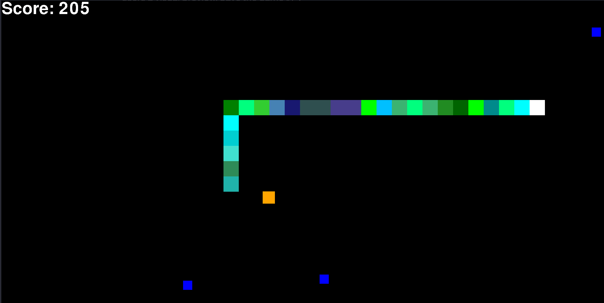

# Snake Game in Python


This Python script implements a classic Snake game using the Pygame library. The player controls a snake that must navigate the game area, collect prizes, and avoid collisions with itself and the boundaries.



## Features

- **Snake Movement:** Use arrow keys to control the direction of the snake (up, down, left, right).
- **Prizes:** Prizes appear randomly on the screen. The snake grows longer and earns points when it consumes a prize.
- **Game Over:** The game ends when the snake collides with the boundaries or itself.
- **Score Tracking:** Keep track of your score as you collect prizes.

## Getting Started

1. **Install Dependencies:**
   - Make sure you have Python installed on your machine.
   - Install the Pygame library using the following command:
     ```bash
     pip install pygame
     ```

2. **Run the Game:**
   - Execute the script using the following command:
     ```bash
     python snake_game.py
     ```

3. **Game Controls:**
   - Use the arrow keys to control the snake:
     - UP: Move Up
     - DOWN: Move Down
     - LEFT: Move Left
     - RIGHT: Move Right

4. **Game Over and Restart:**
   - The game ends if the snake collides with the boundaries or itself.
   - After a game over, you can restart the game by following the on-screen instructions.

## Customize the Game

- You can customize various aspects of the game, such as the speed of the snake, appearance of prizes, and more by modifying the `snake_game.py` script.

## Contributing

If you have suggestions or find issues with the game, feel free to open an issue or submit a pull request.

## License

This project is licensed under the MIT License
